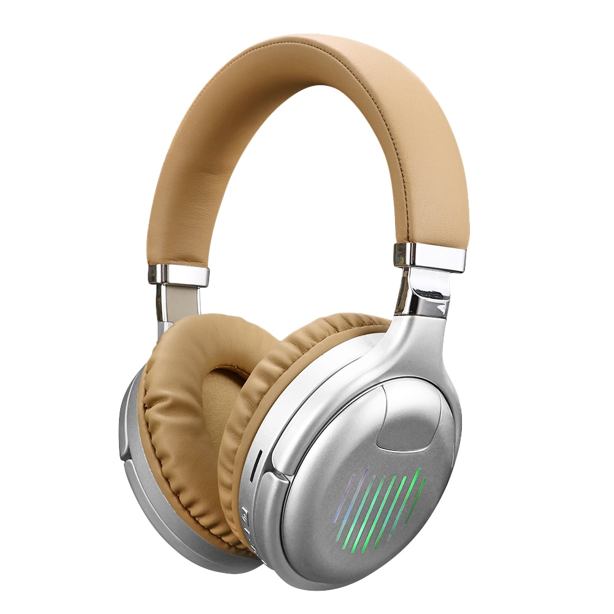
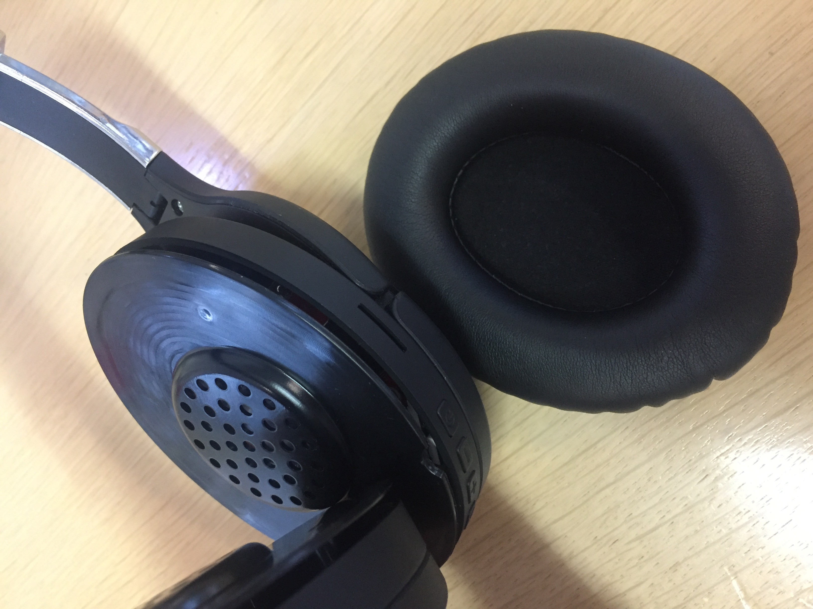
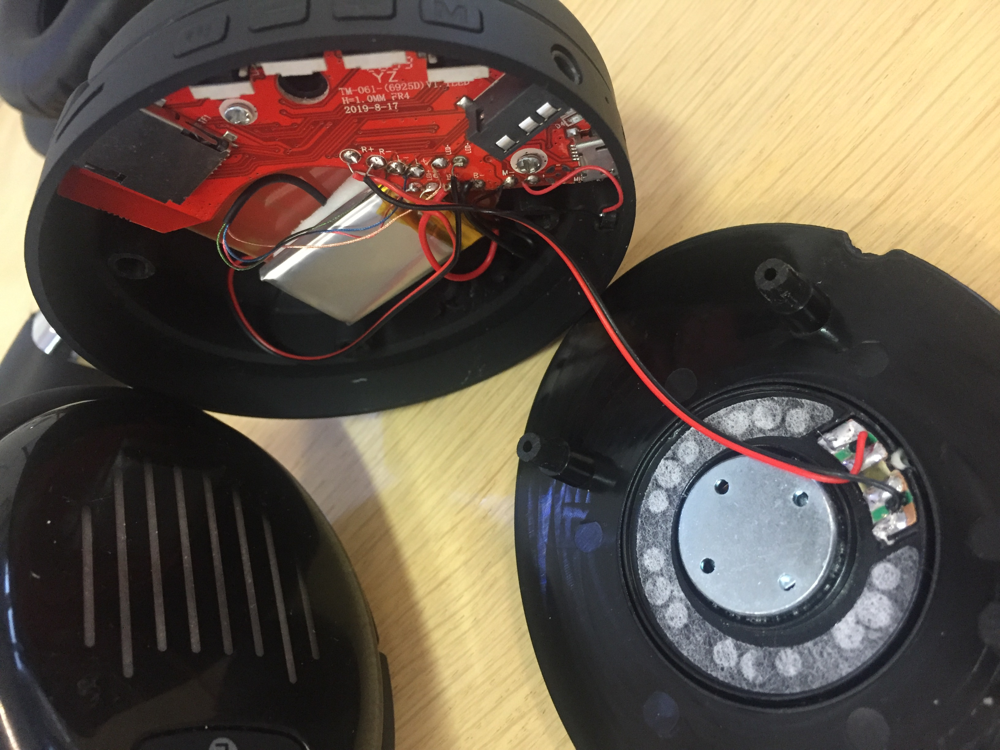
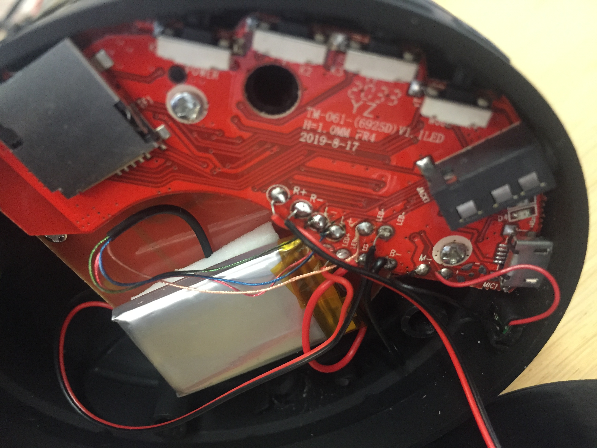
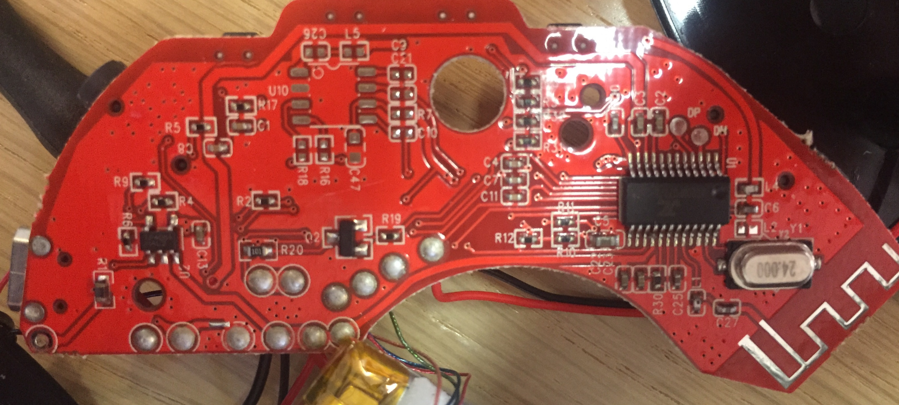
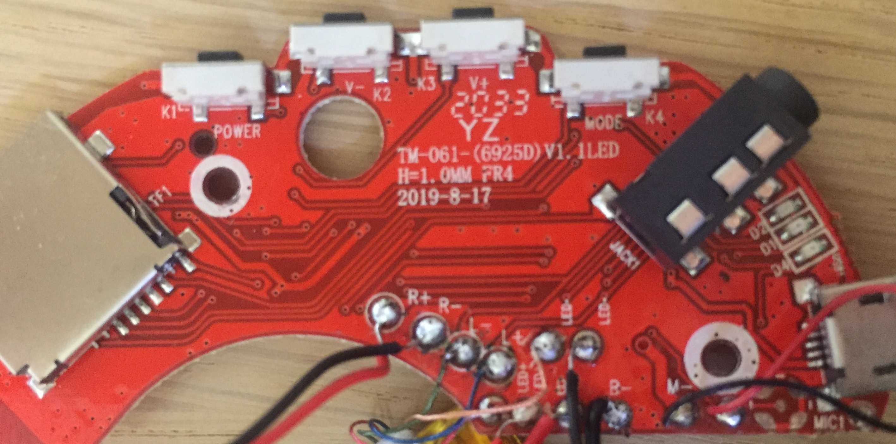
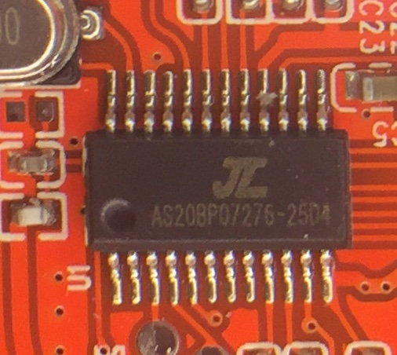

# TM-061 Bluetooth Headphones

This is a technical review of TM-061-(6925D) V1.1 LED wireless headphones.

## Hardware

The battery is very small and does not last long. It could be clearly seen that the headphone inner space is enough to accomodate a much larger battery. The other headphone is completely empty and can accomodate a second battery, given that the power wiring is also added. 

The PCB is equipped with AS20BP07276-2504 by [Zhuhai Jieli Technology](http://www.zh-jieli.com/).

